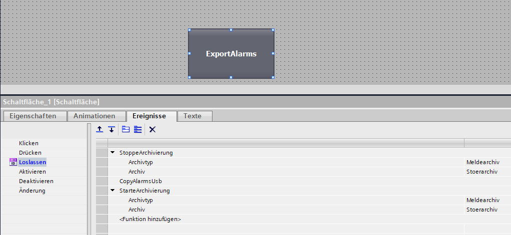
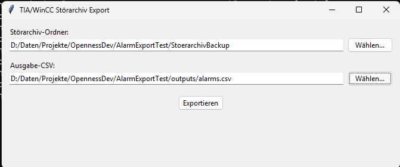

# tia-wincc-alarm-export

## Überblick

Dieses Repository deckt die komplette Kette der Störmeldungs-Auswertung ab —
vom WinCC-Panel bis zur fertigen CSV-Datei:

1. **Ereignis-Konfiguration in WinCC**: Ein Button auf dem Panel stoppt kurz
   die Archivierung, kopiert die Störarchiv-Dateien (`.rdb`) per VBS-Skript
   auf einen USB-Stick und startet die Archivierung wieder.
2. **VBS-Skript `CopyAlarmsUsb`**: kopiert die rotierenden
   Störarchiv-Segmente vom internen Speicher des Panels auf den USB-Stick.
3. **Python-Tool `tia-wincc-alarm-export`** (dieses Repository): liest die
   kopierten `.rdb`-Dateien ein, führt sie chronologisch sortiert zusammen
   und exportiert sie als eine einzige CSV-Datei.

## 1. Ereignis-Konfiguration in WinCC



Auf der Schaltfläche `ExportAlarms` ist im Ereignis **Loslassen** eine
Funktionsfolge hinterlegt:

1. `StoppeArchivierung` (Archivtyp: Meldearchiv, Archiv: Stoerarchiv) —
   stoppt die laufende Archivierung, damit die `.rdb`-Dateien beim Kopieren
   nicht von WinCC gesperrt bzw. gerade beschrieben werden.
2. `CopyAlarmsUsb` — das VBS-Skript, das die Archivdateien kopiert (siehe
   unten).
3. `StarteArchivierung` (Archivtyp: Meldearchiv, Archiv: Stoerarchiv) —
   startet die Archivierung wieder, damit WinCC nahtlos weiter protokolliert.

## 2. VBS-Skript `CopyAlarmsUsb`

Kopiert die bis zu 11 rotierenden Störarchiv-Segmente (`Stoerarchiv0` …
`Stoerarchiv10`) vom internen Speicher des Panels auf einen angeschlossenen
USB-Stick. `bIsPanel` unterscheidet zwischen dem echten Panel (SD-Karte →
USB-Stick) und einer PC-Testumgebung (lokale Ordner) — im produktiven
Einsatz auf dem Panel ist `bIsPanel = True` zu setzen. Fehler pro Datei
(z.B. falls ein Segment noch nicht existiert) werden bewusst ignoriert
(`On Error Resume Next`), damit der Kopiervorgang nicht beim ersten
fehlenden Segment abbricht.

```vbscript
Sub CopyAlarmsUsb()

Dim oFSO, i, sNummer, sQuelle, sZiel
Dim bIsPanel

bIsPanel = False

Set oFSO = CreateObject("Scripting.FileSystemObject")

On Error Resume Next

For i = 0 To 10
	    
	If bIsPanel Then
		
		sQuelle = "\Storage Card SD\Stoerarchiv" & i & ".rdb"
    	sZiel = "\Storage Card USB\Stoerarchiv" & i & ".rdb"
    
	Else
		
		sQuelle = "D:\Tmp\alarms\Stoerarchiv\Stoerarchiv" & i & ".rdb"
    	sZiel = "D:\Tmp\alarms\StoerarchivBackup\Stoerarchiv" & i & ".rdb"
    	
	End If

	oFSO.CopyFile sQuelle, sZiel

Next

On Error GoTo 0
Set oFSO = Nothing

End Sub
```

Der Zielordner (`StoerarchivBackup` bzw. der USB-Stick) ist genau der
Ordner, den das Python-Tool unten als Eingabeordner erwartet.

## 3. Python-Tool: tia-wincc-alarm-export

### Zweck

Führt mehrere WinCC/TIA-Portal-Störarchiv-Dateien (SQLite-Datenbanken,
Endung `.rdb`) aus einem Ordner chronologisch sortiert (nach `Time_ms`) zu
einer einzigen CSV-Datei zusammen.

### Installation

Voraussetzung: Python >= 3.12

```
pip install -e .[dev]
```

### Nutzung

```
tia-wincc-alarm-export
```

oder ohne Installation:

```
python -m tia_wincc_alarm_export.main
```

Es öffnet sich eine GUI: Eingabeordner mit `.rdb`-Dateien wählen (z.B. den
per `CopyAlarmsUsb` befüllten USB-Stick/Backup-Ordner), Ausgabepfad
bestätigen oder ändern (Default: `output/alarms.csv`), Export starten.



### Datenformat

Jede `.rdb`-Datei enthält eine Tabelle `logdata` mit den Spalten `Time_ms,
MsgProc, StateAfter, MsgClass, MsgNumber, Var1..Var8, TimeString, MsgText,
PLC`. `TimeString` ist auf dem Panel immer leer/`None` und wird nicht
verwendet. Die CSV wird als UTF-8 mit BOM (`utf-8-sig`) geschrieben, damit
Excel Umlaute korrekt anzeigt.

#### Zeitstempel (Time_ms / Timestamp)

`Time_ms` ist kein Unix-Timestamp und kein Windows-FILETIME, sondern ein
**OLE Automation Date, skaliert mit 1.000.000** (laut Siemens Dok-ID
109747174): Ganzzahlteil von `Time_ms / 1.000.000` = Tage seit der
OLE-Epoche 30.12.1899, Nachkommastellen = Tagesbruchteil (Uhrzeit). WinCC
Advanced speichert in Lokalzeit des Panels, es ist keine UTC-Konvertierung
nötig. `Time_ms` bleibt unverändert als Rohwert in der CSV erhalten (u.a.
als Sortierschlüssel für die chronologische Reihenfolge) und wird
zusätzlich um eine berechnete Spalte `Timestamp` (lesbares Datum) ergänzt.

Die Umrechnung (`core.timestamp_to_datetime`) ist gegen echte Paneldaten
verifiziert (`Time_ms 46243611628.69` → `09.08.2026 14:40:44`,
`Time_ms 46243561204.19` → `09.08.2026 13:28:08` — deckt sich exakt mit den
Datei-Zeitstempeln der zugehörigen `.rdb`-Backups) und ist panelunabhängig,
da die OLE-Epoche fest ist und nicht kalibriert werden muss.

### Tests

```
pytest
```

## 4. Offene Punkte

- Bisher nur mit einer **Windows-Runtime** (WinCC Advanced Runtime auf PC)
  getestet, inklusive Erzeugung der `.rdb`-Testdateien und Ende-zu-Ende-Test
  des Python-Exports.
- Ein **Test mit einem echten Siemens-Panel** (`bIsPanel = True`, Kopieren
  SD-Karte → USB-Stick) steht noch aus.
